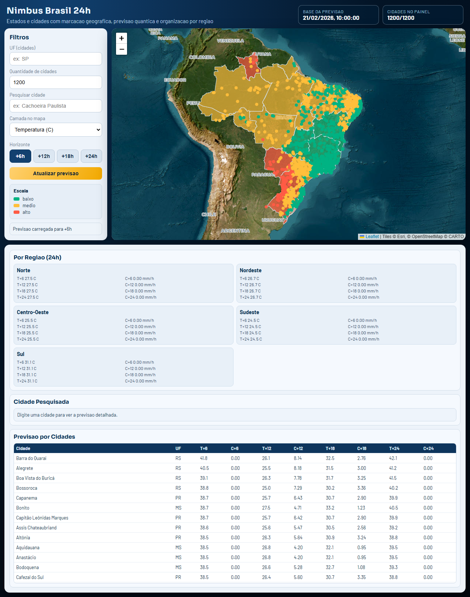
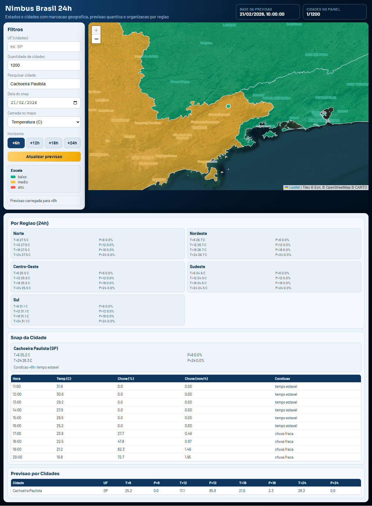
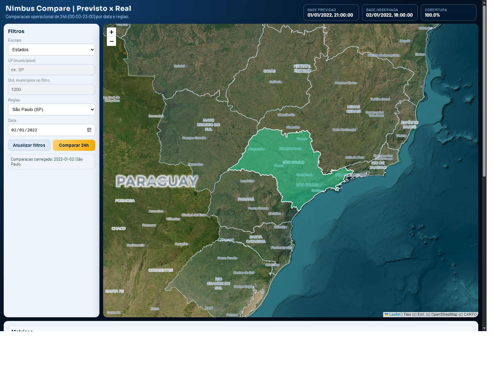

# Nimbus Brasil 24h

Previsao meteorologica operacional para o Brasil com base NASA/IBM Prithvi-WxC, dados MERRA-2 e correcao residual por Machine Learning Quantico (QML), com dashboards web inspirados no padrao DSAT.

## Resumo Tecnico-Cientifico

Este projeto implementa um pipeline completo de previsao local com foco em estados e municipios brasileiros. A arquitetura combina:

1. Modelo base de previsao global (`Prithvi-WxC-1.0-2300M-rollout`, NASA/IBM).
2. Fonte observacional/reanalise (`MERRA-2`) para treino e comparacao previsto x real.
3. Corretor residual hibrido classico-quantico (PennyLane + PyTorch) para reduzir erro regional.
4. API FastAPI e interface web operacional com mapas, visoes 24h hora a hora, snap de cidade/data e dashboard comparativo.

Objetivo pratico: gerar previsoes de temperatura e chuva para as proximas 24h com leitura simples para operacao, mantendo caminho de reproducao e fine tuning local.

## Escopo Implementado

1. Projeto criado e mantido no drive `E:` (`E:\PrevisaoTempoNASA_Quantum_BR`), evitando armazenamento em `C:`.
2. Validacao de dependencias e ambiente Docker (`scripts/bootstrap.ps1` e `scripts/check_dependencies.ps1`).
3. Download e preparacao de dados MERRA-2 para o formato exigido pelo Prithvi-WxC.
4. Treino adaptativo com deteccao de memoria (`mode=auto`) para alternar entre `prithvi` e `persistence`.
5. Fine tuning com busca de hiperparametros, validacao temporal, early stopping e resume de treino.
6. Treino separado por escopo:
   - estado (27 UFs)
   - municipio (amostragem configuravel; em producao, 900 cidades)
7. Dashboards web:
   - painel principal operacional em mapa
   - previsao 24h por regiao e por cidade
   - snap por cidade e data (00:00 a 23:00)
   - comparativo previsto x real hora a hora por data/regiao
8. Endpoints para consumo programatico e governanca de modelos (`/api/model/status`, `/api/forecast/*`).

## Arquitetura do Sistema

### Camada de dados

- Entrada: arquivos MERRA-2 de superficie/vertical + climatologia.
- Catalogo geografico Brasil: estados, municipios e GeoJSON de UFs.
- Features temporais e espaciais: latitude, longitude, seno/cosseno de hora e dia do ano.

### Camada de modelo

- Base:
  - `PrithviForecastEngine` para inferencia global com Prithvi-WxC (quando ha memoria suficiente).
  - Baseline `Persistence` com MERRA-2 para modo leve.
- Corretor quantico:
  - classe `QuantumResidualRegressor` (`src/previsao_tempo_quantico/models/quantum_residual.py`)
  - encoder classico (`Linear -> GELU -> Linear -> Tanh`)
  - circuito variacional (`AngleEmbedding` + `BasicEntanglerLayers`)
  - cabeca residual para correcao final (`baseline + residual`)

### Camada de servico e visualizacao

- API FastAPI (`src/previsao_tempo_quantico/api/main.py`)
- Frontend HTML/CSS/JS (`src/previsao_tempo_quantico/ui`)
- Dashboards operacionais para estado/municipio, snap e comparativo.

## Tecnologias Utilizadas

- Linguagem: Python 3
- API: FastAPI + Uvicorn
- ML: PyTorch, scikit-learn
- QML: PennyLane
- Dados cientificos: Xarray, NetCDF4, H5NetCDF
- Modelo base: `ibm-nasa-geospatial/Prithvi-WxC-1.0-2300M-rollout`
- Infra: Docker + Docker Compose
- UI: HTML5, CSS3, JavaScript, Leaflet

Dependencias principais em `requirements.txt`.

## Dados e Recorte Experimental

Execucao registrada neste workspace:

- Serie MERRA-2 de superficie local: `368` dias
- Janela disponivel em disco: `2020-01-01` ate `2022-01-02`
- Features geradas:
  - `data/features/features_state.csv`: `216` linhas
  - `data/features/features_municipio.csv`: `1,323,000` linhas
- Variaveis previstas: `T2M`, `PRECTOT`, `U10M`, `V10M`

Observacao: o pipeline aceita extensao de janela ate a data atual; basta repetir download/treino no intervalo desejado.

## Metodo de Treino e Otimizacao

### Estrategia de memoria

O treino usa selecao automatica de modo:

- `prithvi`: usa modelo base Prithvi-WxC (alto consumo de memoria)
- `persistence`: baseline leve para hardware limitado
- `auto`: decide com base em RAM/VRAM disponiveis

No treino realizado, o modo efetivo foi `persistence` devido limite de memoria detectado.

### Fine tuning quantico

- Busca em grade com `trials`
- Split temporal treino/validacao
- Early stopping
- Checkpoint incremental e retomada (`resume`)

Hiperparametros finais dos modelos salvos:

- `n_qubits=6`
- `n_layers=2`
- `hidden_dim=24`
- `batch_size=64`
- `learning_rate=0.001`
- `weight_decay=0.0005`

## Resultados Obtidos

### Metricas dos checkpoints

| Modelo | Escopo | RMSE (val) | MAE (val) | Split treino/val |
|---|---|---:|---:|---|
| `quantum_state.pt` | estados | 2.7262 | 1.6765 | 162 / 54 |
| `quantum_municipio.pt` | municipios | 1.1711 | 0.7610 | 1,058,400 / 264,600 |

### Comparativo previsto x observado (24h, hora a hora)

Exemplo validado via API (`/api/forecast/compare24h`):

| Escopo | Filtro | Temp RMSE | Temp MAE | Cobertura |
|---|---|---:|---:|---:|
| estado | `SP`, `2022-01-02` | 4.449 | 3.740 | 100% |
| municipio | `3550308` (Sao Paulo), `2022-01-02` | 7.180 | 6.620 | 100% |

Observacao tecnica: a coluna `data_source_time` reflete o timestamp do dado base disponivel no disco para aquela comparacao.

## Galeria dos Dashboards

### 1) Painel operacional inspirado no DSAT


### 2) Previsao 24h por regiao e cidades



### 3) Snap por cidade e data (hora a hora)



### 4) Comparativo previsto x real (24h)



## Endpoints Principais

- `GET /api/health`
- `GET /api/model/status`
- `GET /api/forecast/latest?scope=state&variable=T2M`
- `GET /api/forecast/next24h?scope=state`
- `GET /api/forecast/next24h?scope=municipio&uf=SP&municipality_limit=1200`
- `GET /api/forecast/snap?city=Cachoeira%20Paulista&uf=SP&date=2026-02-21`
- `GET /api/forecast/compare24h/meta?scope=state`
- `GET /api/forecast/compare24h?scope=state&region=SP&date=2022-01-02`
- `GET /api/geo/states`

## Reproducao do Projeto (Passo a Passo)

1. Preparar ambiente:

```powershell
cd E:\PrevisaoTempoNASA_Quantum_BR
Copy-Item .env.example .env
powershell -ExecutionPolicy Bypass -File .\scripts\bootstrap.ps1
powershell -ExecutionPolicy Bypass -File .\scripts\check_dependencies.ps1
```

2. Baixar e preparar MERRA-2:

```powershell
docker compose run --rm trainer python scripts/download_merra2.py --source hf-public --start 2020-01-01T00:00:00 --end 2026-02-17T18:00:00 --step-hours 6 --allow-missing --max-missing-ratio 1.0
```

3. Treinar modelo por estado:

```powershell
docker compose run --rm trainer python scripts/train_quantum.py --config configs/train.yaml --scope state --mode auto --fine-tune --tuning-trials 8
```

4. Treinar modelo por municipio:

```powershell
docker compose run --rm trainer python scripts/train_quantum.py --config configs/train.yaml --scope municipio --mode auto --municipality-limit 900 --fine-tune --tuning-trials 6
```

5. Retomar treino sem perder progresso:

```powershell
powershell -ExecutionPolicy Bypass -File .\scripts\train_auto.ps1 -Scope municipio -Mode auto -Device cpu -FineTune -TuningTrials 6 -Resume -ReuseFeatures
```

6. Subir API e dashboards:

```powershell
docker compose up api
```

Acesse: `http://localhost:8000`

## Limites Atuais e Evolucao para Producao

- Cobertura temporal depende da base MERRA-2 local disponivel.
- Modo `prithvi` completo exige hardware robusto (RAM/VRAM elevadas).
- Para producao real-time, recomenda-se:
  - rotina de ingestao diaria automatica
  - monitoramento de drift por regiao
  - validacao continua de metricas por horizonte
  - versionamento de checkpoints por data

## Fontes Cientificas e Tecnicas

- Hugging Face NASA/IBM Geospatial:
  - https://huggingface.co/ibm-nasa-geospatial
- Prithvi-WxC:
  - https://github.com/NASA-IMPACT/Prithvi-WxC
- MERRA-2 (NASA GES DISC):
  - https://disc.gsfc.nasa.gov/datasets?project=MERRA-2
- Referencia visual operacional (CPTEC DSAT):
  - https://www.cptec.inpe.br/dsat/
